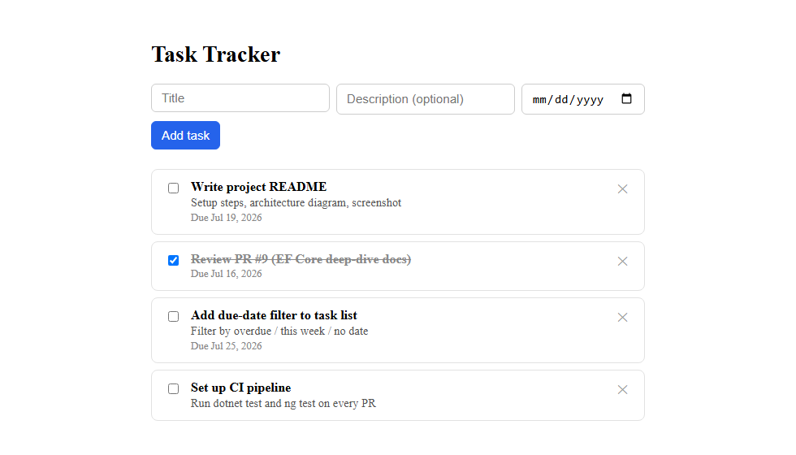
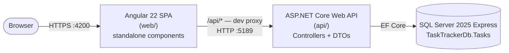

# Task Tracker

A small full-stack task tracker — ASP.NET Core Web API backend, Angular
frontend, SQL Server database — built as a hands-on way to learn Angular
from an ASP.NET/EF Core background.



## Features

- Create, complete, and delete tasks, each with an optional description and
  due date
- Optimistic UI updates (checking a task off updates instantly, rolls back
  on API failure)
- Client-side + server-side validation, with inline error messages
- EF Core in-memory-database test suite for the API, Vitest suite for the
  frontend

## Architecture



- **`web/`** — Angular 22, standalone components, `signal()`-based state.
  Components never touch `HttpClient` directly — a typed `TaskService`
  wraps it. The dev server proxies `/api/*` to the API (`proxy.conf.json`),
  so the frontend only ever knows about a relative `/api` URL.
- **`api/`** — ASP.NET Core Web API, code-first EF Core. Controllers return
  DTOs (never EF entities) to keep the wire contract stable and avoid
  leaking change-tracking state.
- **SQL Server** — one table, `Tasks` (`Id`, `Title`, `Description`,
  `IsDone`, `DueDate`, `CreatedAt`), evolved entirely through EF Core
  migrations.

## Tech stack

| Layer    | Tech                                          |
| -------- | ---------------------------------------------- |
| Frontend | Angular 22, standalone components, Vitest      |
| Backend  | .NET 10, ASP.NET Core Web API, EF Core, xUnit  |
| Database | SQL Server 2025 Express                        |

## Getting started

### Prerequisites

- .NET 10 SDK
- Node.js + npm
- SQL Server 2025 Express running locally

### 1. Database

Apply migrations from `/api` (creates `TaskTrackerDb` if it doesn't exist):

```bash
cd api
dotnet ef database update
```

### 2. API

```bash
cd api
dotnet run
```

Runs on `http://localhost:5189` (the `http` launch profile — this is what
the Angular dev proxy expects). Swagger UI:
`http://localhost:5189/swagger/index.html`.

> Use `dotnet run --launch-profile https` only if you need TLS directly;
> that profile forces HTTP→HTTPS redirects, which breaks the Angular proxy.
> It also needs a trusted dev cert once per machine:
> `dotnet dev-certs https --trust`.

### 3. Web

The dev server runs over HTTPS. Export the trusted ASP.NET Core dev cert
once per machine so the browser trusts `https://localhost:4200`:

```bash
cd web
mkdir .cert
dotnet dev-certs https --export-path .cert/localhost.pem --format Pem --no-password
```

Then:

```bash
cd web
npm install
ng serve
```

Runs at `https://localhost:4200`, proxying `/api/*` to the API.

### Secrets

Connection strings live in `api/appsettings.Development.json`
(gitignored) — never in `appsettings.json`.

## Tests

```bash
cd api && dotnet test   # xUnit, against an EF Core in-memory database
cd web && ng test       # Vitest — components and TaskService
```

## What I learned

This project was as much about learning Angular as it was about building a
task tracker — coming from an ASP.NET/EF Core background with almost no
frontend experience. A few things that stood out:

- **Signals click faster than expected once you've used `INotifyPropertyChanged`.**
  `signal()` / computed state ended up feeling closer to a reactive view
  model than to anything React-shaped — the mental model transferred more
  from WPF/MVVM instincts than from prior JS work.
- **`Observable` is not `Task<T>`.** The habit of `await`-ing everything
  had to go — an `Observable` doesn't start doing anything until something
  subscribes, and `HttpClient`'s calls are cold by default. Getting the
  optimistic-update / rollback flow right in `TaskService` meant actually
  understanding that distinction instead of treating RxJS like `async`/`await`
  with extra steps.
- **EF Core's change tracking is invisible until it isn't.** Returning DTOs
  instead of entities from every controller action wasn't just about a
  stable wire contract — it sidesteps `DbContext` tracking state leaking
  into JSON in ways that are hard to notice from the ASP.NET side until
  something serializes oddly.
- **Tooling permissions are worth reading closely.** The SQL Server MCP
  server has `execute_query` disabled by default behind an env var — a
  deliberate high-risk gate, not a bug (see
  [`docs/mcp-sqlserver-issues.md`](docs/mcp-sqlserver-issues.md)).

Deeper write-ups from working through both stacks:

- [`docs/angular-web-deep-dive.md`](docs/angular-web-deep-dive.md) — the
  `/web` app, explained for an ASP.NET developer
- [`docs/api-efcore-deep-dive.md`](docs/api-efcore-deep-dive.md) — EF Core,
  explained for an ASP.NET Web API developer who's never used it
